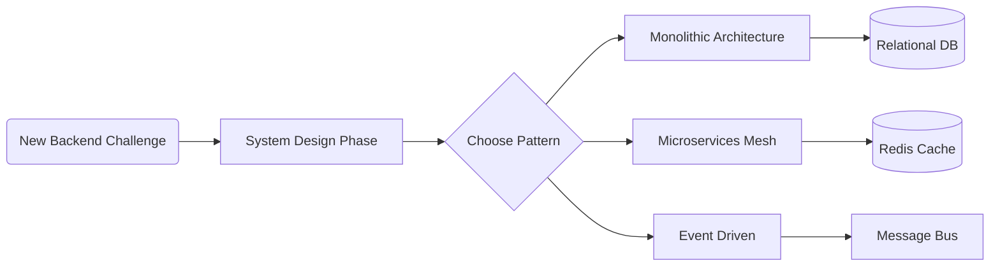
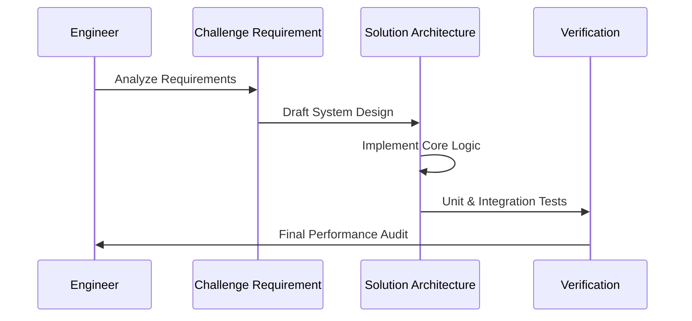

# 🏛️ Architect Challenges: Expert Backend Solutions

Architect Challenges is a curated collection of high-level coding challenges and
architectural problems used by top-tier tech companies globally. This
repository serves as a master reference for backend engineers aiming to build
scalable, fault-tolerant, and performant systems.

## 🏗️ Knowledge Roadmap

## ⚡ Challenge Categories

I have categorized these real-world challenges by difficulty and focus area to
help you navigate the best solutions:

| Tier | Focus Area | Key Technologies |
| :--- | :--- | :--- |
| **Enterprise** | Scalability & Microservices | Spring Cloud, Kubernetes, Go |
| **High Performance** | Concurrency & Data | Node.js, C++, Rust, PostgreSQL |
| **Reliability** | Fault Tolerance & Auth | Python, OAuth2, Docker, Sentry |

## 🔄 Problem Solving Workflow

## 🚀 Featured Challenges

This collection includes challenges from companies like:

- **Uber**: Real-time dispatching and routing.
- **AfterShip**: High-throughput tracking systems.
- **PicPay**: Scalable payment processing.
- **Schibsted**: Distributed content delivery.

---
*Curated and Solutioned by Saanvi Rajput. Empowering the next generation of
System Architects.*
